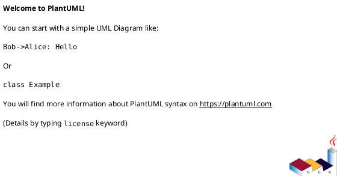
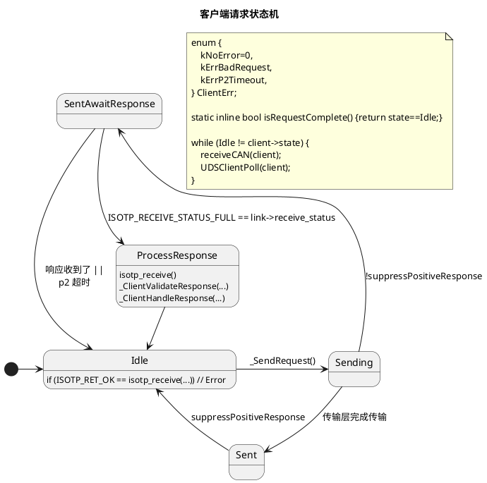
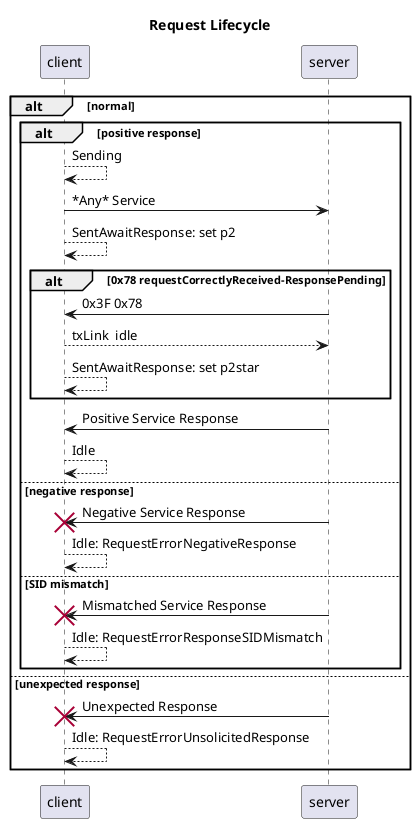
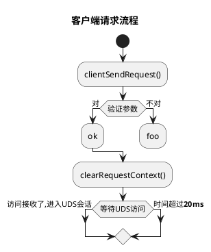
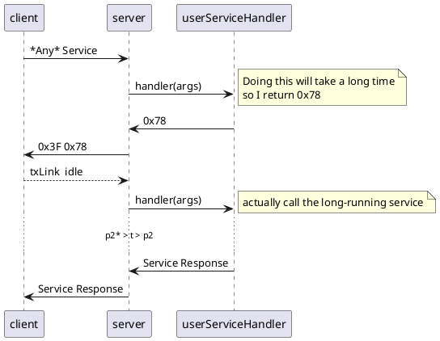
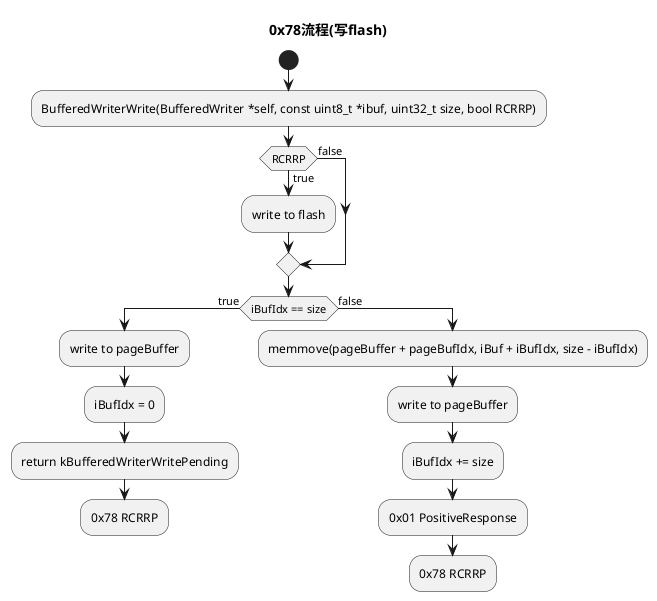

Sending an Idle event serves as a trigger to go to the next state.

Is there a way to make it usable with or without the fn?
- callback fn is better for non-blocking systems because it enables test of fn
- nonblocking is better for threaded systems because it's simpler


Client events

- Guarantee that no more than one of the same type of event is raised per call
- errors should be returned before idle
- validating of response should happen 
    UDS_EVT_ResponseReceived should be renamed if it only fires when the response is valid
    - alternately, the data can contain a struct with NRC

What's better behavior for when the server returns an NRC?

```c
case UDS_EVT_ResponseReceived: {
    int nrc = *(int*)arg;
    switch (nrc) {
        case UDS_OK:
            ...
            break;
        default:
            break;
    }
}
```


```c
UDSClientPoll() {
  client->fn(UDS_EVT_POLL);
  if (client->state == kRequestStateIdle) {
    client->fn(UDS_EVT_Idle);
  } elif (client->state == kRequestStateSending) {
    ...
  } elif (client->state == kRequestStateAwaitSendComplete) {

  } elif (client->state == kRequestStateAwaitResponse) {

  } elif (client->state == kRequestState)
  
}
```




# Design Docs


## ISO-TP interface

`iso14229` supports opaque transports. Use `Iso14229TpHandle_t` to wrap a transport. 


### PDU transmission complete

ISO14229-1 2013 6.1 describes a request-confirmation primitive to "indicate that the date passed in the service request primitive is successfully sent on the vehicle communication bus the diagnostic tester is connected to"


#### ISOTP-C
- **polling**
- `IsoTpLink.send_status` is either `IDLE`, `INPROGRESS`, or `ERROR`

#### PCAN-ISO-TP
- **polling**
 - https://www.peak-system.com/PCAN-ISO-TP-API.372.0.html
 - `PCAN-ISO-TP_2016.h` contains a function for reading the transport status which includes `PCANTP_ISOTP_MSGTYPE_FLAG_INDICATION_TX`

#### linux kernel isotp driver
- **blocking**
- https://github.com/hartkopp/can-isotp/issues/27 (Get status of transmission?)
- https://github.com/hartkopp/can-isotp/issues/51


If you're using the linux kernel driver, then you have threads and can use the excellent `python-udsoncan` to implement a client.

----
- "The Functional addressing is applied only to single frame transmission" -- Specification of Diagnostic Communication (Diagnostic on CAN - Network Layer)
- 

```plantuml
@startuml

@enduml
```

## Client State Machine








## Server 0x78 requestCorrectlyReceived-ResponsePending




