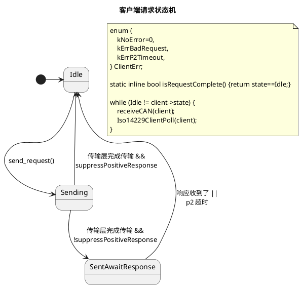
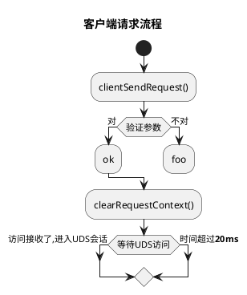

# iso14229

iso14229是个针对嵌入式系统的UDS(ISO14229-1:2013)服务器和客户端执行。

iso14229 is a UDS server and client implementation (ISO14229-1:2013) targeting embedded systems.

**Stability: Experimental**

# iso14229 用户文档 User Documentation

## 服务器：怎么用 / Server: Basic Usage


```c
#define SRV_PHYS_RECV_ID 0x7A0
#define SRV_FUNC_RECV_ID 0x7A1
#define SRV_SEND_ID 0x7A8

#define ISOTP_BUFSIZE 256

static uint8_t isotpPhysRecvBuf[ISOTP_BUFSIZE];
static uint8_t isotpPhysSendBuf[ISOTP_BUFSIZE];
static uint8_t isotpFuncRecvBuf[ISOTP_BUFSIZE];
static uint8_t isotpFuncSendBuf[ISOTP_BUFSIZE];

static IsoTpLink isotpPhysLink;
static IsoTpLink isotpFuncLink;
static Iso14229Server uds;

void hardReset() {
    printf("server hardReset! %u\n", isotp_user_get_ms());
}

const Iso14229ServerConfig cfg = {
    .phys_recv_id = SRV_PHYS_RECV_ID,
    .func_recv_id = SRV_FUNC_RECV_ID,
    .send_id = SRV_SEND_ID,
    .phys_link = &isotpPhysLink,
    .func_link = &isotpFuncLink,
    .userRDBIHandler = NULL,
    .userWDBIHandler = NULL,
    .userHardReset = hardReset,
    .p2_ms = 50,
    .p2_star_ms = 2000,
    .s3_ms = 5000,
};

Iso14229Server srv;

void simpleServerInit() {
    /* initialize the ISO-TP links */
    isotp_init_link(&isotpPhysLink, SRV_SEND_ID, isotpPhysSendBuf, ISOTP_BUFSIZE, isotpPhysRecvBuf, ISOTP_BUFSIZE);
    isotp_init_link(&isotpFuncLink, SRV_SEND_ID, isotpFuncSendBuf, ISOTP_BUFSIZE, isotpFuncRecvBuf, ISOTP_BUFSIZE);

    Iso14229ServerInit(&srv, &cfg);
    iso14229ServerEnableService(&srv, kSID_ECU_RESET);
}

void simpleServerPeriodicTask() {
    uint32_t arb_id;
    uint8_t data[8];
    uint8_t size;

    Iso14229ServerPoll(&srv);
    if (0 == hostCANRxPoll(&arb_id, data, &size)) {
        iso14229ServerReceiveCAN(&srv, arb_id, data, size);
    }
}

```

## 服务器：例子 / Server: Example (linux)

See [example](/example) for a simple server with socketCAN bindings

```sh
# 设置虚拟socketCAN接口
# setup a virtual socketCAN interface
sudo ip link add name can9 type vcan
sudo ip link set can9 up

# 构建例子服务器
# build the example server
make example/linux

# 在can9接口上运行例子服务器
# run the example server on can9
./example/linux can9
```

```sh
# 在另外一个终端，安装python依赖性
# In another shell, install the required python packages
pip3 install -r requirements.txt

# 然后运行客户端
# then run the client
./example/client.py can9
```

```sh
# （可选）在另外一个终端，看看虚拟CAN母线上的数据
# (Optional) In a third shell, monitor the virtual link
candump can9
```


## 服务器：自定服务回调函数 / Server: Custom Service Handlers

| Service | `iso14229` Function |
| - | - |
| 0x31 RoutineControl | `int iso14229ServerRegisterRoutine(Iso14229Server* self, const Iso14229Routine *routine);` |
| 0x34 RequestDownload, 0x36 TransferData, 0x37 RequestTransferExit | `int iso14229ServerRegisterDownloadHandler(Iso14229Server* self, Iso14229DownloadHandlerConfig *handler);` |

## 服务器：应用/启动软件（中间件） / Server: Application / Boot Software (Middleware)


## 贡献/contributing

欢迎来贡献

- add mock ISO-TP layer to allow test coverage of transport errors and low transport speed

# 感谢 / Acknowledgements

- [`isotp`](https://github.com/lishen2/isotp-c) which this project embeds

# License

MIT

# 变更记录 / Changelog


## 0.0.0
- initial release

## 0.1.0
- Add client
- Add server SID 0x27 SecurityAccess
- API changes

# iso14229开发文档 / design docs

## 客户端请求状态机




