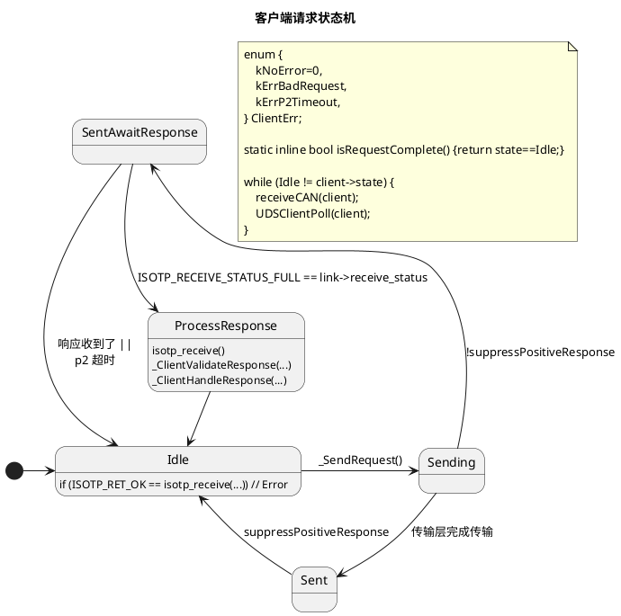
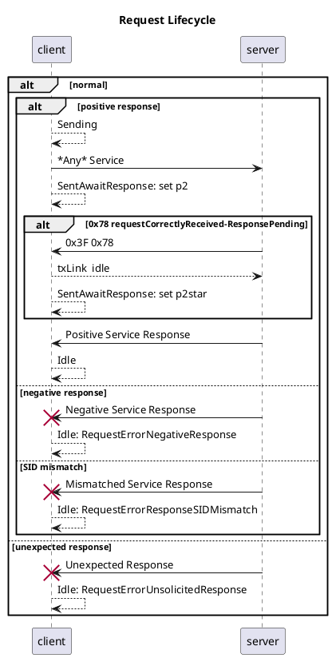
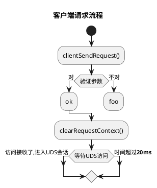
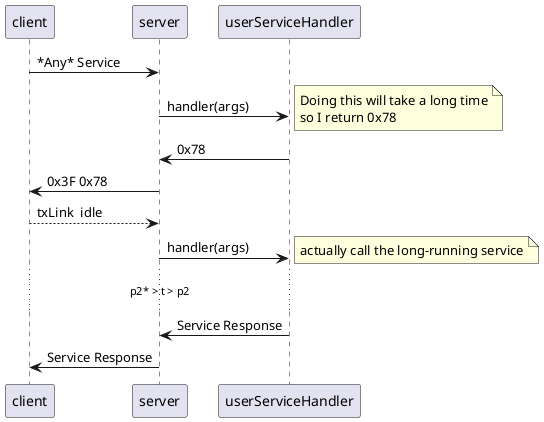
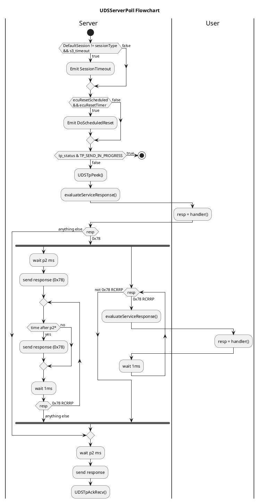
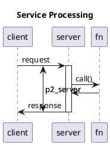
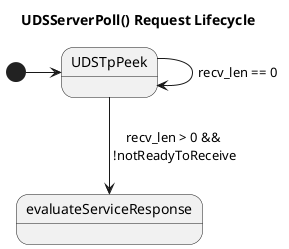
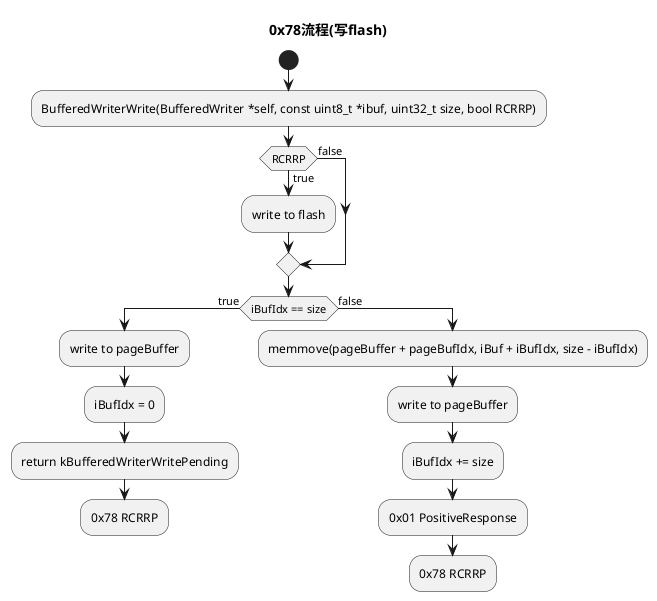

# iso14229

<p align="center">
<a href="https://github.com/driftregion/iso14229/actions"></a>
<a href="./LICENSE"></a>
</p>

<p align="center">
  <a href="README_zh.md">简体中文</a>
</p>

iso14229 is an implementation of UDS (ISO14229-1:2013) targeting embedded systems. It is tested with [`isotp-c`](https://github.com/lishen2/isotp-c) as well as [linux kernel](https://github.com/linux-can/can-utils/blob/master/include/linux/can/isotp.h) ISO15765-2 (ISO-TP) transport layer implementations. 

API status: **not yet stable**. 


## Quick Start

1. Get `iso14229.c` and `iso14229.h` from the [release](./release) directory, copy into your source tree and build.
2. See [examples](./examples).

## Features

- static memory allocation. does not use `malloc`, `calloc`
- easy to integrate. Download `iso14229.c` and `iso14229.h` from the releases page and copy into your source tree.
- highly portable and tested
    - architectures: arm, x86-64, ppc, ppc64, risc
    - systems: linux, Windows, esp32, Arduino, NXP s32k
    - transports: isotp-c, linux isotp sockets
- cares about security
    - server has fuzz test, see [test/README.md](test/README.md)
    -

## Preprocessor Defines

| Define | Description | Valid values |
| - | - | - |
| `UDS_SYS` | Select a porting target | see `sys.h` |
| `UDS_TP` | Select a transport layer | see `tp.h` |
| `UDS_...` | Additional compile-time config options | see `config.h` |

##  supported functions (server and client )

| SID | name | supported |
| - | - | - |
| 0x10 | diagnostic session control | ✅ |
| 0x11 | ECU reset | ✅ |
| 0x14 | clear diagnostic information | ❌ |
| 0x19 | read DTC information | ❌ |
| 0x22 | read data by identifier | ✅ |
| 0x23 | read memory by address | ❌ |
| 0x24 | read scaling data by identifier | ❌ |
| 0x27 | security access | ✅ |
| 0x28 | communication control | ✅ |
| 0x2A | read periodic data by identifier | ❌ |
| 0x2C | dynamically define data identifier | ❌ |
| 0x2E | write data by identifier | ✅ |
| 0x2F | input control by identifier | ❌ |
| 0x31 | routine control | ✅ |
| 0x34 | request download | ✅ |
| 0x35 | request upload | ✅ |
| 0x36 | transfer data | ✅ |
| 0x37 | request transfer exit | ✅ |
| 0x38 | request file transfer | ❌ |
| 0x3D | write memory by address | ❌ |
| 0x3E | tester present | ✅ |
| 0x83 | access timing parameter | ❌ |
| 0x84 | secured data transmission | ❌ |
| 0x85 | control DTC setting | ✅ |
| 0x86 | response on event | ❌ |

# Documentation

## Server Events

see `enum UDSServerEvent` in [iso14229.h](./iso14229.h)

### `UDS_SRV_EVT_DiagSessCtrl` (0x10)

#### Arguments

```c
typedef struct {
    const enum UDSDiagnosticSessionType type; /**< requested session type */
    uint16_t p2_ms;                           /**< optional return value: p2 timing override */
    uint32_t p2_star_ms;                      /**< optional return value: p2* timing override */
} UDSDiagSessCtrlArgs_t;
```

#### Supported Responses

| Value  | enum                 | Meaning | 
| - | - | - | 
| `0x00` | `kPositiveResponse` | Request to change diagnostic level accepted. |
| `0x12` | `kSubFunctionNotSupported` | The server doesn't support this diagnostic level |
| `0x22` | `kConditionsNotCorrect` | The server can't/won't transition to the specified diagnostic level at this time |

### `UDS_SRV_EVT_ECUReset` (0x11)

#### Arguments

```c
typedef struct {
    const enum UDSECUResetType type; /**< reset type requested by client */
    uint8_t powerDownTime; /**< Optional response: notify client of time until shutdown (0-254) 255
                              indicates that a time is not available. */
} UDSECUResetArgs_t;
```

#### Supported Responses

| Value  | enum                 | Meaning | 
| - | - | - | 
| `0x00` | `kPositiveResponse` | Request to reset ECU accepted.  |
| `0x12` | `kSubFunctionNotSupported` | The server doesn't support the specified type of ECU reset |
| `0x22` | `kConditionsNotCorrect` | The server can't reset now |
| `0x33` | `kSecurityAccessDenied` | The current level of security access doesn't permit this type of ECU reset |

### `UDS_SRV_EVT_ReadDataByIdent` (0x22)

#### Arguments

```c
typedef struct {
    const uint16_t dataId; /*! data identifier */
    /*! function for copying to the server send buffer. Returns `kPositiveResponse` on success and `kResponseTooLong` if the length of the data to be copied exceeds that of the server send buffer */
    const uint8_t (*copy)(UDSServer_t *srv, const void *src,
                    uint16_t count); 
} UDSRDBIArgs_t;
```

#### Supported Responses

| Value  | enum                 | Meaning | 
| - | - | - | 
| `0x00` | `kPositiveResponse` | Request to read data accepted (be sure to call `copy(...)`) |
| `0x14` | `kResponseTooLong` | The total length of the response message exceeds the transport buffer size |
| `0x31` | `kRequestOutOfRange` | The requested data identifer isn't supported |
| `0x33` | `kSecurityAccessDenied` | The current level of security access doesn't permit reading the requested data identifier |

### `UDS_SRV_EVT_SecAccessRequestSeed`, `UDS_SRV_EVT_SecAccessValidateKey` (0x27)

#### Arguments

```c
typedef struct {
    const uint8_t level;             /*! requested security level */
    const uint8_t *const dataRecord; /*! pointer to request data */
    const uint16_t len;              /*! size of request data */
    /*! function for copying to the server send buffer. Returns `kPositiveResponse` on success and `kResponseTooLong` if the length of the data to be copied exceeds that of the server send buffer */
    uint8_t (*copySeed)(UDSServer_t *srv, const void *src,
                        uint16_t len);
} UDSSecAccessRequestSeedArgs_t;

typedef struct {
    const uint8_t level;      /*! security level to be validated */
    const uint8_t *const key; /*! key sent by client */
    const uint16_t len;       /*! length of key */
} UDSSecAccessValidateKeyArgs_t;
```
#### Supported Responses

| Value  | enum                 | Meaning | 
| - | - | - | 
| `0x00` | `kPositiveResponse` | Request accepted  |
| `0x12` | `kSubFunctionNotSupported` | The requested security level is not supported |
| `0x22` | `kConditionsNotCorrect` | The server can't handle the request right now |
| `0x31` | `kRequestOutOfRange` | The `dataRecord` contains invalid data |
| `0x35` | `kInvalidKey` | The key doesn't match |
| `0x36` | `kExceededNumberOfAttempts` | False attempt limit reached |
| `0x37` | `kRequiredTimeDelayNotExpired` | RequestSeed request received and delay timer is still active |

### `UDS_SRV_EVT_CommCtrl` (0x28)

#### Arguments

```c
typedef struct {
    enum UDSCommunicationControlType ctrlType; 
    enum UDSCommunicationType commType;
} UDSCommCtrlArgs_t;
```
#### Supported Responses

| Value  | enum                 | Meaning | 
| - | - | - | 
| `0x00` | `kPositiveResponse` | Request accepted  |
| `0x12` | `kSubFunctionNotSupported` | The requested control type is not supported |
| `0x22` | `kConditionsNotCorrect` | The server can't enable/disable the selected communication type now |
| `0x31` | `kRequestOutOfRange` | The requested control type or communication type is erroneous |

### `UDS_SRV_EVT_WriteDataByIdent` (0x2E)

#### Arguments

```c
typedef struct {
    const uint16_t dataId;     /*! WDBI Data Identifier */
    const uint8_t *const data; /*! pointer to data */
    const uint16_t len;        /*! length of data */
} UDSWDBIArgs_t;
```

#### Supported Responses

| Value  | enum                 | Meaning | 
| - | - | - | 
| `0x00` | `kPositiveResponse` | Request to write data accepted  |
| `0x22` | `kConditionsNotCorrect` | The server can't write this data now |
| `0x31` | `kRequestOutOfRange` | The requested data identifer isn't supported or the data is invalid |
| `0x33` | `kSecurityAccessDenied` | The current level of security access doesn't permit writing to the requested data identifier |
| `0x72` | `kGeneralProgrammingFailure` | Memory write failed |

### `UDS_SRV_EVT_RoutineCtrl` (0x31)

#### Arguments

```c
typedef struct {
    const uint8_t ctrlType;      /*! routineControlType */
    const uint16_t id;           /*! routineIdentifier */
    const uint8_t *optionRecord; /*! optional data */
    const uint16_t len;          /*! length of optional data */
    /*! function for copying to the server send buffer. Returns `kPositiveResponse` on success and `kResponseTooLong` if the length of the data to be copied exceeds that of the server send buffer */
    uint8_t (*copyStatusRecord)(UDSServer_t *srv, const void *src,
                                uint16_t len);
} UDSRoutineCtrlArgs_t;
```

#### Supported Responses

| Value  | enum                 | Meaning | 
| - | - | - | 
| `0x00` | `kPositiveResponse` | Request accepted  |
| `0x22` | `kConditionsNotCorrect` | The server can't perform this operation now |
| `0x24` | `kRequestSequenceError` | Stop requested but routine hasn't started. Start requested but routine has already started (optional). Results are not available becuase routine has never started. |
| `0x31` | `kRequestOutOfRange` | The requested routine identifer isn't supported or the `optionRecord` is invalid |
| `0x33` | `kSecurityAccessDenied` | The current level of security access doesn't permit this operation |
| `0x72` | `kGeneralProgrammingFailure` | internal memory operation failed (e.g. erasing flash) |

### `UDS_SRV_EVT_RequestDownload` (0x34)

#### Arguments

```c
typedef struct {
    const void *addr;                   /*! requested address */
    const size_t size;                  /*! requested download size */
    const uint8_t dataFormatIdentifier; /*! optional specifier for format of data */
    uint16_t maxNumberOfBlockLength; /*! response: inform client how many data bytes to send in each
                                        `TransferData` request */
} UDSRequestDownloadArgs_t;
```

#### Supported Responses

| Value  | enum                 | Meaning | 
| - | - | - | 
| `0x00` | `kPositiveResponse` | Request accepted  |
| `0x22` | `kConditionsNotCorrect` | The server can't perform this operation now |
| `0x31` | `kRequestOutOfRange` | `dataFormatIdentifier` invalid, `addr` or `size` invalid |
| `0x33` | `kSecurityAccessDenied` | The current level of security access doesn't permit this operation |
| `0x34` | `kAuthenticationRequired` | Client rights insufficient |
| `0x70` | `kUploadDownloadNotAccepted` | download cannot be accomplished due to fault |


### `UDS_SRV_EVT_TransferData` (0x36)

#### Arguments

```c
typedef struct {
    const uint8_t *const data; /*! transfer data */
    const uint16_t len;        /*! transfer data length */
    /*! function for copying to the server send buffer. Returns `kPositiveResponse` on success and `kResponseTooLong` if the length of the data to be copied exceeds that of the server send buffer */
    uint8_t (*copyResponse)(
        UDSServer_t *srv, const void *src,
        uint16_t len);
} UDSTransferDataArgs_t;
```

#### Supported Responses

| Value  | enum                 | Meaning | 
| - | - | - | 
| `0x00` | `kPositiveResponse` | Request accepted  |
| `0x31` | `kRequestOutOfRange` | `data` contents invalid, length incorrect |
| `0x72` | `kGeneralProgrammingFailure` | Memory write failed |
| `0x92` | `kVoltageTooHigh` | Can't write flash: voltage too high |
| `0x93` | `kVoltageTooLow` | Can't write flash: voltage too low |

### `UDS_SRV_EVT_RequestTransferExit` (0x37)

#### Arguments

```c
typedef struct {
    const uint8_t *const data; /*! request data */
    const uint16_t len;        /*! request data length */
    /*! function for copying to the server send buffer. Returns `kPositiveResponse` on success and `kResponseTooLong` if the length of the data to be copied exceeds that of the server send buffer */
    uint8_t (*copyResponse)(UDSServer_t *srv, const void *src,
                            uint16_t len);
} UDSRequestTransferExitArgs_t;
```

#### Supported Responses

| Value  | enum                 | Meaning | 
| - | - | - | 
| `0x00` | `kPositiveResponse` | Request accepted  |
| `0x31` | `kRequestOutOfRange` | `data` contents invalid, length incorrect |
| `0x72` | `kGeneralProgrammingFailure` | finalizing the data transfer failed |

## Examples

[examples/README.md](examples/README.md)

### Running Tests

```sh
make test
```

# Contributing

contributions are welcome


# Acknowledgements

- [`isotp-c`](https://github.com/lishen2/isotp-c) which this project embeds

# License

MIT

# Changelog


## 0.7.0
- test refactoring. theme: test invariance across different transports and processor architectures
- breaking API changes:
    - overhauled transport layer implementation
    - simplified client and server init
    - `UDS_ARCH_` renamed to `UDS_SYS_`

## 0.6.0
- breaking API changes:
    - `UDSClientErr_t` merged into `UDSErr_t`
    - `TP_SEND_INPROGRESS` renamed to `UDS_TP_SEND_IN_PROGRESS`
    - refactored `UDSTpHandle_t` to encourage struct inheritance
    - `UDS_TP_LINUX_SOCKET` renamed to `UDS_TP_ISOTP_SOCKET`
- added server fuzz test and qemu tests
- cleaned up example tests, added isotp-c on socketcan to examples
- added `UDS_SRV_EVT_DoScheduledReset`
- improve client error handling

## 0.5.0
- usability: refactored into a single .c/.h module
- usability: default transport layer configs are now built-in
- API cleanup: use `UDS` prefix on all exported functions
- API cleanup: use a single callback function for all server events

## 0.4.0
- refactor RDBIHandler to pass a function pointer that implements safe memmove rather than requiring the user to keep valid data around for an indefinite time or risking a buffer overflow.
- Prefer fixed-width. Avoid using `enum` types as return types and in structures.
- Transport layer is now pluggable and supports the linux kernel ISO-TP driver in addition to `isotp-c`. See [examples](./examples/README.md).

## 0.3.0
- added `iso14229ClientRunSequenceBlocking(...)`
- added server and client examples
- simplified test flow, deleted opaque macros and switch statements
- flattened client and server main structs
- simplified usage by moving isotp-c initialization parameters into server/client config structs 
- remove redundant buffers in server

## 0.2.0
- removed all instances of `__attribute__((packed))`
- refactored server download functional unit API to simplify testing
- refactored tests
    - ordered by service
    - documented macros
- removed middleware 
- simplified server routine control API
- removed redundant function `iso14229ServerEnableService`
- updated example

## 0.1.0
- Add client
- Add server SID 0x27 SecurityAccess
- API changes

## 0.0.0
- initial release

---

# Design Docs

## ISO-TP interface

`iso14229` supports opaque transports. Use `Iso14229TpHandle_t` to wrap a transport. 


### PDU transmission complete

ISO14229-1 2013 6.1 describes a request-confirmation primitive to "indicate that the date passed in the service request primitive is successfully sent on the vehicle communication bus the diagnostic tester is connected to"


#### ISOTP-C
- **polling**
- `IsoTpLink.send_status` is either `IDLE`, `INPROGRESS`, or `ERROR`

#### PCAN-ISO-TP
- **polling**
 - https://www.peak-system.com/PCAN-ISO-TP-API.372.0.html
 - `PCAN-ISO-TP_2016.h` contains a function for reading the transport status which includes `PCANTP_ISOTP_MSGTYPE_FLAG_INDICATION_TX`

#### linux kernel isotp driver
- **blocking**
- https://github.com/hartkopp/can-isotp/issues/27 (Get status of transmission?)
- https://github.com/hartkopp/can-isotp/issues/51


If you're using the linux kernel driver, then you have threads and can use the excellent `python-udsoncan` to implement a client.

----
- "The Functional addressing is applied only to single frame transmission" -- Specification of Diagnostic Communication (Diagnostic on CAN - Network Layer)
- 

```plantuml
@startuml

@enduml
```

## Client State Machine








## Server 0x78 requestCorrectlyReceived-ResponsePending













