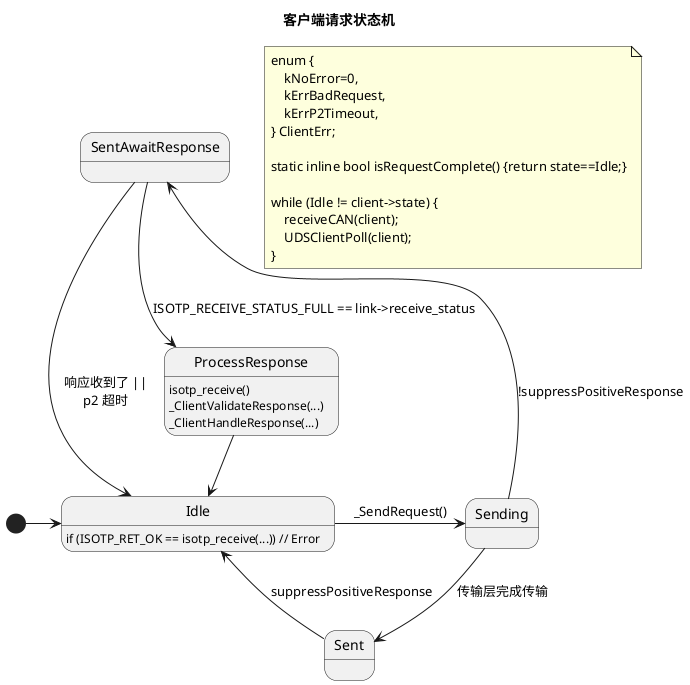
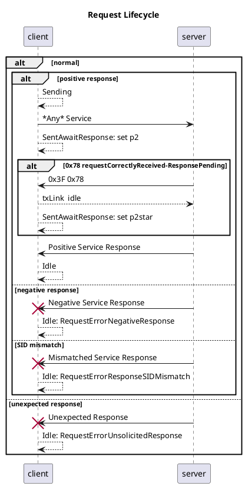
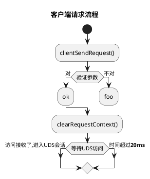
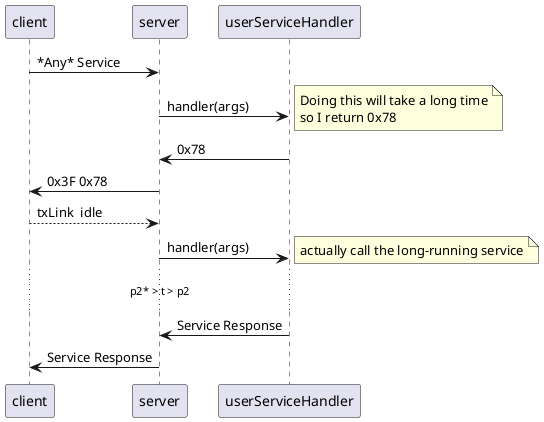
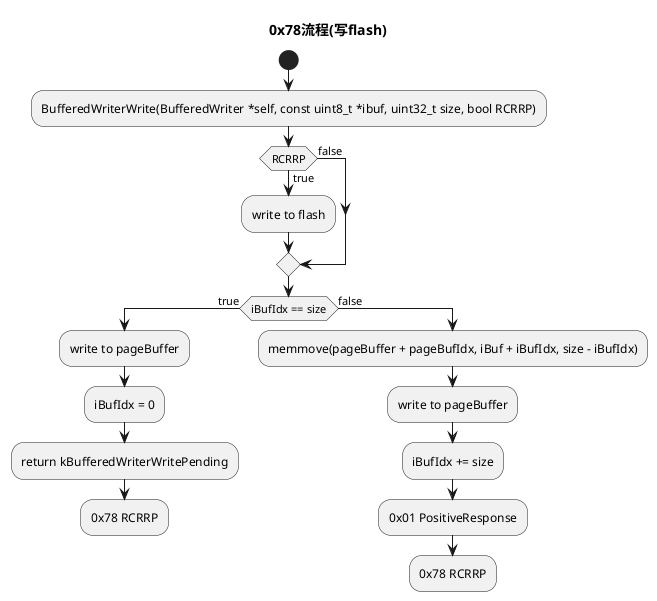

# iso14229

<p align="center">
<a href="https://github.com/driftregion/iso14229/actions"></a>
<a href="./LICENSE"></a>
</p>

<p align="center">
  <a href="README_zh.md">简体中文</a>
</p>

iso14229 is a server and client session-layer implementation of (ISO14229-1:2013) targeting embedded systems. It is tested with [`isotp-c`](https://github.com/lishen2/isotp-c) as well as [linux kernel](https://github.com/linux-can/can-utils/blob/master/include/linux/can/isotp.h) ISO15765-2 (ISO-TP) transport layer implementations. 

API status: **not yet stable**

## quickstart: server

```c
#include "iso14229.h"

static uint8_t fn(UDSServer_t *srv, UDSServerEvent_t ev, const void *arg) {
    return kServiceNotSupported;
}

int main() {
    UDSServer_t server;
    UDSServerConfig_t cfg = {
        .fn = &fn,
    };
    UDSServerInit(&server, &cfg);
    for (;;) {
        UDSServerPoll(&server);
    }
}
```

## quickstart: client

```c
// see examples/client.c
```

## Preprocessor Defines

| Define | Description | Valid values |
| - | - | - |
| `UDS_ARCH` | Select a porting target | `UDS_ARCH_CUSTOM`, `UDS_ARCH_UNIX` |
| `UDS_TP` | Select a transport layer | `UDS_TP_ISOTP_C`, `UDS_TP_LINUX_SOCKET` |
| `UDS_CUSTOM_MILLIS` | Use your own `millis()` implementation | defined or not defined |

Features:
- all memory allocation is static
- architecture-independent
    - tested: arm, x86-64, ppc
    - tests run under qemu 
- has many existing unit-tests and tests are easy to extend

##  supported functions (server and client )

| SID | name | supported |
| - | - | - |
| 0x10 | diagnostic session control | ✅ |
| 0x11 | ECU reset | ✅ |
| 0x14 | clear diagnostic information | ❌ |
| 0x19 | read DTC information | ❌ |
| 0x22 | read data by identifier | ✅ |
| 0x23 | read memory by address | ❌ |
| 0x24 | read scaling data by identifier | ❌ |
| 0x27 | security access | ✅ |
| 0x28 | communication control | ✅ |
| 0x2A | read periodic data by identifier | ❌ |
| 0x2C | dynamically define data identifier | ❌ |
| 0x2E | write data by identifier | ✅ |
| 0x2F | input control by identifier | ❌ |
| 0x31 | routine control | ✅ |
| 0x34 | request download | ✅ |
| 0x35 | request upload | ❌ |
| 0x36 | transfer data | ✅ |
| 0x37 | request transfer exit | ✅ |
| 0x38 | request file transfer | ❌ |
| 0x3D | write memory by address | ❌ |
| 0x3E | tester present | ✅ |
| 0x83 | access timing parameter | ❌ |
| 0x84 | secured data transmission | ❌ |
| 0x85 | control DTC setting | ✅ |
| 0x86 | response on event | ❌ |

# Documentation

## Examples

[examples/README.md](examples/README.md)

## Tests

[test_uds.c](test_uds.c)

### Running Tests

```sh
make test
```

## qemu

```sh
CC=powerpc-linux-gnu-gcc make test_bin
qemu-ppc -L /usr/powerpc-linux-gnu test_bin
```
## wine

```sh
CC=x86_64-w64-mingw32-gcc make test_bin
wine test_bin.exe
```


# Contributing

contributions are welcome


# Acknowledgements

- [`isotp-c`](https://github.com/lishen2/isotp-c) which this project embeds

# License

MIT

# Changelog

## 0.0.0
- initial release

## 0.1.0
- Add client
- Add server SID 0x27 SecurityAccess
- API changes

## 0.2.0
- removed all instances of `__attribute__((packed))`
- refactored server download functional unit API to simplify testing
- refactored tests
    - ordered by service
    - documented macros
- removed middleware 
- simplified server routine control API
- removed redundant function `iso14229ServerEnableService`
- updated example

## 0.3.0
- added `iso14229ClientRunSequenceBlocking(...)`
- added server and client examples
- simplified test flow, deleted opaque macros and switch statements
- flattened client and server main structs
- simplified usage by moving isotp-c initialization parameters into server/client config structs 
- remove redundant buffers in server


## 0.4.0
- refactor RDBIHandler to pass a function pointer that implements safe memmove rather than requiring the user to keep valid data around for an indefinite time or risking a buffer overflow.
- Prefer fixed-width. Avoid using `enum` types as return types and in structures.
- Transport layer is now pluggable and supports the linux kernel ISO-TP driver in addition to `isotp-c`. See [examples](./examples/README.md).

## 0.5.0
- usability: refactored into a single .c/.h module
- usability: default transport layer configs are now built-in
- API cleanup: use `UDS` prefix on all exported functions
- API cleanup: use a single callback function for all server events

---

# Design Docs


## ISO-TP interface

`iso14229` supports opaque transports. Use `Iso14229TpHandle_t` to wrap a transport. 


### PDU transmission complete

ISO14229-1 2013 6.1 describes a request-confirmation primitive to "indicate that the date passed in the service request primitive is successfully sent on the vehicle communication bus the diagnostic tester is connected to"


#### ISOTP-C
- **polling**
- `IsoTpLink.send_status` is either `IDLE`, `INPROGRESS`, or `ERROR`

#### PCAN-ISO-TP
- **polling**
 - https://www.peak-system.com/PCAN-ISO-TP-API.372.0.html
 - `PCAN-ISO-TP_2016.h` contains a function for reading the transport status which includes `PCANTP_ISOTP_MSGTYPE_FLAG_INDICATION_TX`

#### linux kernel isotp driver
- **blocking**
- https://github.com/hartkopp/can-isotp/issues/27 (Get status of transmission?)
- https://github.com/hartkopp/can-isotp/issues/51


If you're using the linux kernel driver, then you have threads and can use the excellent `python-udsoncan` to implement a client.

----
- "The Functional addressing is applied only to single frame transmission" -- Specification of Diagnostic Communication (Diagnostic on CAN - Network Layer)
- 

```plantuml
@startuml

@enduml
```

## Client State Machine








## Server 0x78 requestCorrectlyReceived-ResponsePending




