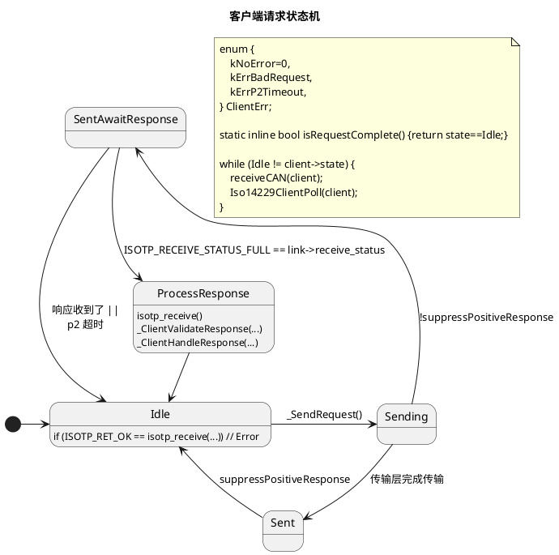
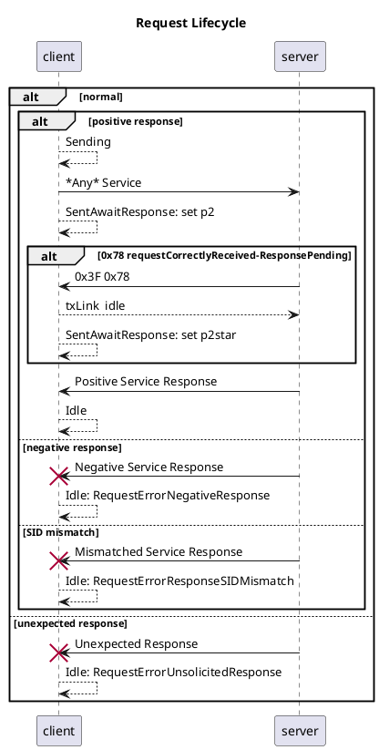
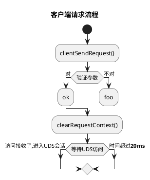
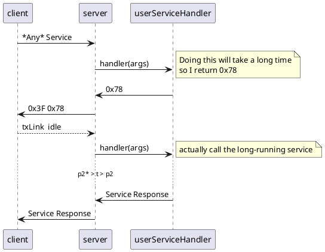
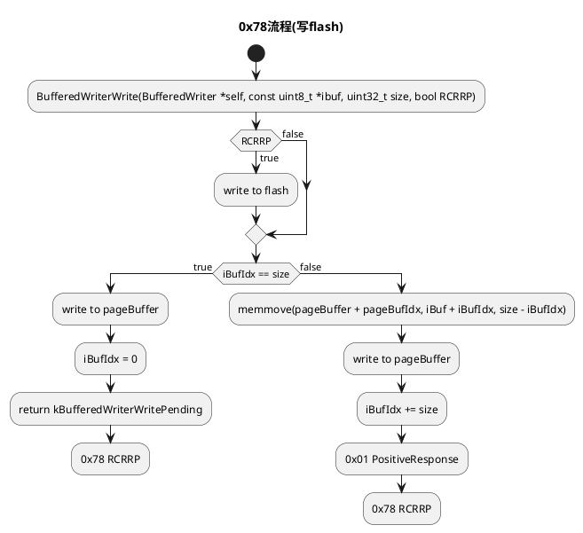

# iso14229

iso14229是个针对嵌入式系统的UDS(ISO14229-1:2013)服务器和客户端执行。

iso14229 is a UDS server and client implementation (ISO14229-1:2013) for embedded systems.

**Stability: Usable**

# iso14229 文档 / Documentation

## 服务器：怎么用 / Server: Usage

See [example](/example) for a simple server with socketCAN bindings

```sh
# 设置虚拟socketCAN接口
# setup a virtual socketCAN interface
sudo ip link add name can9 type vcan
sudo ip link set can9 up

# 构建例子服务器
# build the example server
make example/linux

# 在can9接口上运行例子服务器
# run the example server on can9
./example/linux can9
```

```sh
# （可选）在另外一个终端，看看虚拟CAN母线上的数据
# (Optional) In a another shell, monitor the virtual link
candump can9
```

```sh
# 在另外一个终端，安装python依赖性
# In another shell, install the required python packages
pip3 install -r example/requirements.txt

# 然后运行客户端
# then run the client
./example/client.py can9
```

## 服务器：自定服务回调函数 / Server: Custom Service Handlers

| Service | `iso14229` Function |
| - | - |
| 0x11 ECUReset | `void userHardReset()` |
| 0x22 ReadDataByIdentifier | `enum Iso14229ResponseCode userRDBIHandler(uint16_t dataId, const uint8_t *data, uint16_t *len)` |
| 0x28 CommunicationControl | `enum Iso14229ResponseCode userCommunicationControlHandler(uint8_t controlType, uint8_t communicationType)` |
| 0x2E WriteDataByIdentifier | `enum Iso14229ResponseCode userWDBIHandler(uint16_t dataId, const uint8_t *data, uint16_t len)` |
| 0x31 RoutineControl | `int Iso14229ServerRegisterRoutine(Iso14229Server* self, const Iso14229Routine *routine);` |
| 0x34 RequestDownload, 0x36 TransferData, 0x37 RequestTransferExit | `int iso14229ServerRegisterDownloadHandler(Iso14229Server* self, Iso14229DownloadHandlerConfig *handler);` |

## 服务器：应用/启动软件（中间件） / Server: Application / Boot Software (Middleware)

用户自定的服务器逻辑（比如ISO-14229规范指定的”Application Software"和"Boot Software"）可以用中间件来实现。
User-defined server behavior such as the "Application Software" and "Boot Software" described in ISO-14229 can be implemented through middleware.

```c
struct Iso14229UserMiddleware;
```

## 客户端：怎么用 / Client: Basic Usage

Currently undocumented. See `test_iso14229.c` for usage examples

## 贡献/contributing

欢迎来贡献/contributions are welcome


# 感谢 / Acknowledgements

- [`isotp`](https://github.com/lishen2/isotp-c) which this project embeds

# License

MIT

# 变更记录 / Changelog


## 0.0.0
- initial release

## 0.1.0
- Add client
- Add server SID 0x27 SecurityAccess
- API changes

# iso14229开发文档 / design docs

```sh
bazel test --compilation_mode=dbg //...
```

## 客户端请求状态机








## 服务器 0x78 requestCorrectlyReceived-ResponsePending





