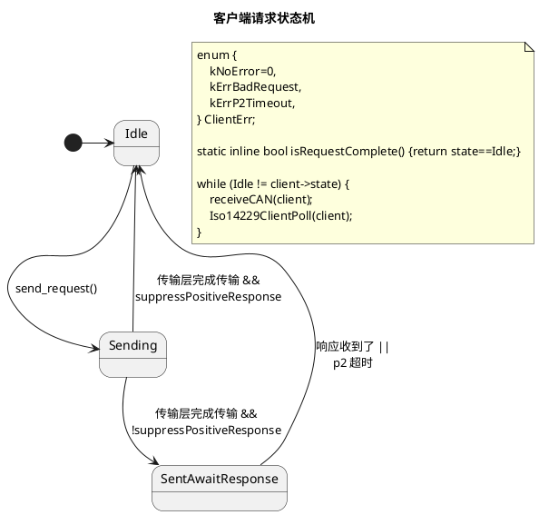
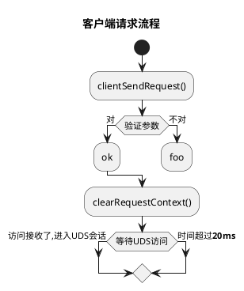

# iso14229

iso14229是个针对嵌入式系统的UDS(ISO14229-1:2013)服务器和客户端执行。

iso14229 is a UDS server and client implementation (ISO14229-1:2013) targeting embedded systems.

**Stability: Experimental**

# iso14229 文档 / Documentation

## 服务器：怎么用 / Server: Usage

```c

// =====================================
// STEP 1: implement the hooks
// =====================================
/**
* @brief iso14229.h required function
* Implement this with the functions available on your host platform
 */
int userSendCAN(const uint32_t arbitration_id, const uint8_t *data, const uint8_t size) {
    struct can_frame frame = {0};

    frame.can_id = arbitration_id;
    frame.can_dlc = size;
    memmove(frame.data, data, size);

    if (write(g_sockfd, &frame, sizeof(struct can_frame)) != sizeof(struct can_frame)) {
        perror("Write err");
        exit(-1);
    }
    return 0;
}

/**
 * @brief iso14229.h required function
 * Implement this with the functions available on your host platform
 */
uint32_t userGetms() {
    struct timeval te;
    gettimeofday(&te, NULL);                                         // get current time
    long long milliseconds = te.tv_sec * 1000LL + te.tv_usec / 1000; // calculate milliseconds
    return milliseconds;
}

/**
 * @brief iso14229.h required function
 * Implement this with the functions available on your host platform
 */
void userDebug(const char *fmt, ...) {}

/**
 * @brief Reset the server
 */
void hardReset() { printf("server hardReset!\n"); }

// =====================================
// STEP 2: initialize the server
// =====================================

int main(int ac, char **av) {
    // setup the linux CAN socket. This will vary depending on your platform. see example/server.c
    setupSocket(ac, av); 

    uint8_t isotpPhysRecvBuf[ISOTP_BUFSIZE];
    uint8_t isotpPhysSendBuf[ISOTP_BUFSIZE];
    uint8_t isotpFuncRecvBuf[ISOTP_BUFSIZE];
    uint8_t isotpFuncSendBuf[ISOTP_BUFSIZE];
    uint8_t udsSendBuf[ISOTP_BUFSIZE];
    uint8_t udsRecvBuf[ISOTP_BUFSIZE];

    IsoTpLink isotpPhysLink;
    IsoTpLink isotpFuncLink;
    Iso14229Server uds;

    const Iso14229ServerConfig cfg = {
        .phys_recv_id = SRV_PHYS_RECV_ID,
        .func_recv_id = SRV_FUNC_RECV_ID,
        .send_id = SRV_SEND_ID,
        .phys_link = &isotpPhysLink,
        .func_link = &isotpFuncLink,
        .receive_buffer = udsRecvBuf,
        .receive_buf_size = sizeof(udsRecvBuf),
        .send_buffer = udsSendBuf,
        .send_buf_size = sizeof(udsSendBuf),
        .userRDBIHandler = NULL,
        .userWDBIHandler = NULL,
        .userHardReset = hardReset,
        .userGetms = userGetms,
        .p2_ms = 50,
        .p2_star_ms = 2000,
        .s3_ms = 5000,
    };

    Iso14229Server srv;

    /* initialize the ISO-TP links */
    isotp_init_link(&isotpPhysLink, SRV_SEND_ID, isotpPhysSendBuf, sizeof(isotpPhysSendBuf),
                    isotpPhysRecvBuf, sizeof(isotpPhysRecvBuf), userGetms, userSendCAN,
                    userDebug);
    isotp_init_link(&isotpFuncLink, SRV_SEND_ID, isotpFuncSendBuf, sizeof(isotpFuncSendBuf),
                    isotpFuncRecvBuf, sizeof(isotpFuncRecvBuf), userGetms, userSendCAN,
                    userDebug);

    Iso14229ServerInit(&srv, &cfg);
    iso14229ServerEnableService(&srv, kSID_ECU_RESET);

    // =====================================
    // STEP 3: poll the server
    // =====================================

    while (!g_should_exit) {
        uint32_t arb_id;
        uint8_t data[8];
        uint8_t size;

        Iso14229ServerPoll(&srv);
        if (0 == CANRxPoll(&arb_id, data, &size)) {
            iso14229ServerReceiveCAN(&srv, arb_id, data, size);
        }
        msleep(10);
    }
}

```

## 服务器：例子 / Server: Example (linux)

See [example](/example) for a simple server with socketCAN bindings

```sh
# 设置虚拟socketCAN接口
# setup a virtual socketCAN interface
sudo ip link add name can9 type vcan
sudo ip link set can9 up

# 构建例子服务器
# build the example server
make example/linux

# 在can9接口上运行例子服务器
# run the example server on can9
./example/linux can9
```

```sh
# （可选）在另外一个终端，看看虚拟CAN母线上的数据
# (Optional) In a another shell, monitor the virtual link
candump can9
```

```sh
# 在另外一个终端，安装python依赖性
# In another shell, install the required python packages
pip3 install -r example/requirements.txt

# 然后运行客户端
# then run the client
./example/client.py can9
```

## 服务器：自定服务回调函数 / Server: Custom Service Handlers

| Service | `iso14229` Function |
| - | - |
| 0x11 ECUReset | `void userHardReset()` |
| 0x22 ReadDataByIdentifier | `enum Iso14229ResponseCode userRDBIHandler(uint16_t dataId, const uint8_t *data, uint16_t *len)` |
| 0x27 SecurityAccess | `enum Iso14229ResponseCode userSecurityAccessHandler()` |
| 0x28 CommunicationControl | `enum Iso14229ResponseCode userCommunicationControlHandler(uint8_t controlType, uint8_t communicationType)` |
| 0x2E WriteDataByIdentifier | `enum Iso14229ResponseCode userWDBIHandler(uint16_t dataId, const uint8_t *data, uint16_t len)` |
| 0x31 RoutineControl | `int iso14229ServerRegisterRoutine(Iso14229Server* self, const Iso14229Routine *routine);` |
| 0x34 RequestDownload, 0x36 TransferData, 0x37 RequestTransferExit | `int iso14229ServerRegisterDownloadHandler(Iso14229Server* self, Iso14229DownloadHandlerConfig *handler);` |

## 服务器：应用/启动软件（中间件） / Server: Application / Boot Software (Middleware)

用户自定的服务器逻辑（比如ISO-14229规范指定的”Application Software"和"Boot Software"）可以用中间件来实现。
User-defined server behavior such as the "Application Software" and "Boot Software" described in ISO-14229 can be implemented through middleware.

```c
struct Iso14229UserMiddleware;
```

## 客户端：怎么用 / Client: Basic Usage

Currently undocumented. See `test_iso14229.c` for usage examples

## 贡献/contributing

欢迎来贡献/contributions are welcome


# 感谢 / Acknowledgements

- [`isotp`](https://github.com/lishen2/isotp-c) which this project embeds

# License

MIT

# 变更记录 / Changelog


## 0.0.0
- initial release

## 0.1.0
- Add client
- Add server SID 0x27 SecurityAccess
- API changes

# iso14229开发文档 / design docs

## 客户端请求状态机




