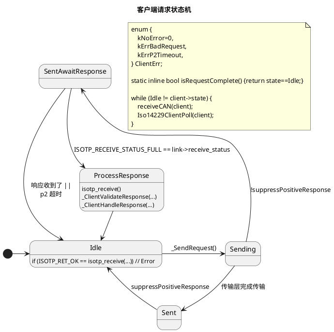
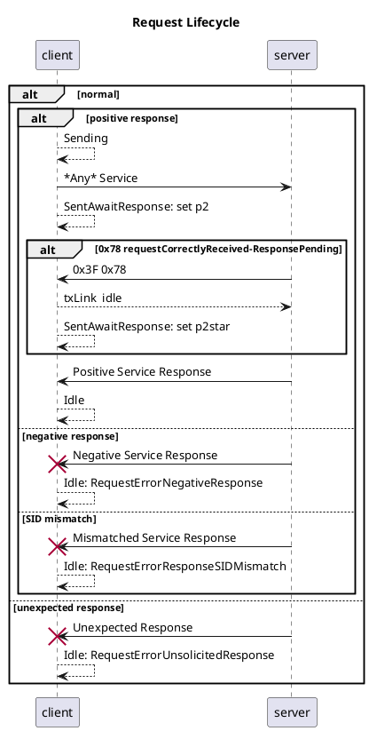
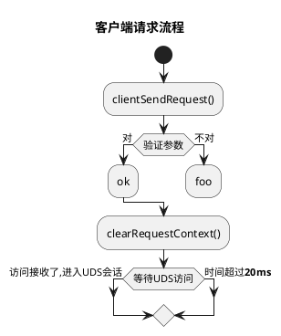
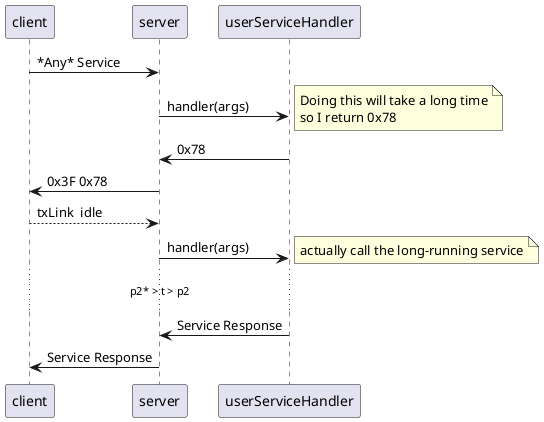
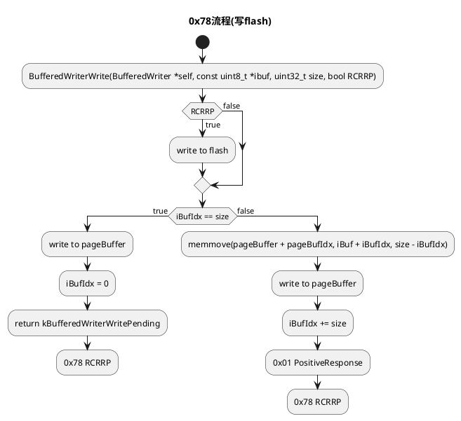

# iso14229

<p align="center">
<a href="https://github.com/driftregion/iso14229/actions"></a>
<a href="./LICENSE"></a>
</p>

iso14229是个针对嵌入式系统的UDS(ISO14229-1:2013)服务器和客户端实现。这一套已包含[`isotp-c`](https://github.com/lishen2/isotp-c) ISO15765-2 (ISO-TP)传输层。

API状态: **不稳定** 

特点:
- 依赖性注入
- 静态内存分配
- 独立于处理器架构
    - 测试了: arm, x86-64, ppc
    - 可以用qemu测试更多
- 单元测试又多又容易扩展

##  支持服务(服务器和客户端)

| SID | 英文名 | 支持 |
| - | - | - |
| 0x10 | diagnostic session control | ✅ |
| 0x11 | ECU reset | ✅ |
| 0x14 | clear diagnostic information | ❌ |
| 0x19 | read DTC information | ❌ |
| 0x22 | read data by identifier | ✅ |
| 0x23 | read memory by address | ❌ |
| 0x24 | read scaling data by identifier | ❌ |
| 0x27 | security access | ✅ |
| 0x28 | communication control | ✅ |
| 0x2A | read periodic data by identifier | ❌ |
| 0x2C | dynamically define data identifier | ❌ |
| 0x2E | write data by identifier | ✅ |
| 0x2F | input control by identifier | ❌ |
| 0x31 | routine control | ✅ |
| 0x34 | request download | ✅ |
| 0x35 | request upload | ❌ |
| 0x36 | transfer data | ✅ |
| 0x37 | request transfer exit | ✅ |
| 0x38 | request file transfer | ❌ |
| 0x3D | write memory by address | ❌ |
| 0x3E | tester present | ✅ |
| 0x83 | access timing parameter | ❌ |
| 0x84 | secured data transmission | ❌ |
| 0x85 | control DTC setting | ✅ |
| 0x86 | response on event | ❌ |

# iso14229 文档 

## 例子

[examples/README.md](examples/README.md)

## 测试

[test_iso14229.c](test_iso14229.c)

### 运行测试 

```sh
make test
```

## qemu

```sh
CC=powerpc-linux-gnu-gcc make test_bin
qemu-ppc -L /usr/powerpc-linux-gnu test_bin
```
## wine

```sh
CC=x86_64-w64-mingw32-gcc make test_bin
wine test_bin.exe
```


# 贡献

欢迎提交贡献


# 感谢 

- [`isotp`](https://github.com/lishen2/isotp-c) which this project embeds

# 许可

MIT

# 变更记录

## 0.0.0
- 初次发布

## 0.1.0
- 加客户端
- 加服务器SID 0x27安全访问
- API更改

## 0.2.0
- 
- 删除所有`__attribute__((packed))`
- 为了简化测试、重构服务器下载功能单元
- 重构测试 
    - 按服务排列 
    - 给宏定义写文档 
- 删掉了中间件 
- 简化了服务器例程控制API 
- 删掉了重复函数`iso14229ServerEnableService` 
- 更新例子 

## 0.3.0
- 加`iso14229ClientRunSequenceBlocking(...)` 
- 加了服务器和客户端例子 
- 简化测试流程、删掉了过分模糊宏定义和switch结构 
- 服务器和客户端结构体简化：尽量用一层深度 
- 简化使用、放isotp-c初始化参数到服务器/客户端配置里面 
- 删除重复服务器缓冲器 

---


# iso14229开发文档 


## 客户端请求状态机








## 服务器 0x78 requestCorrectlyReceived-ResponsePending





