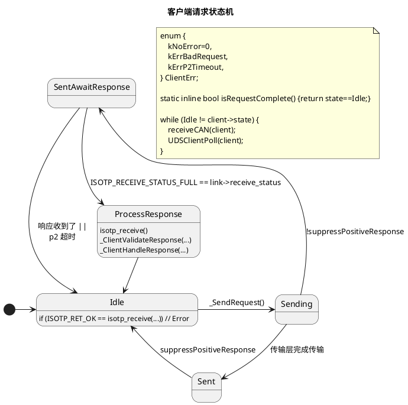
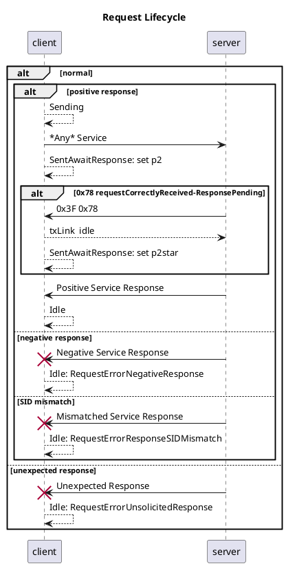
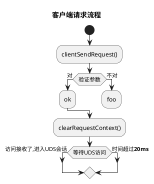
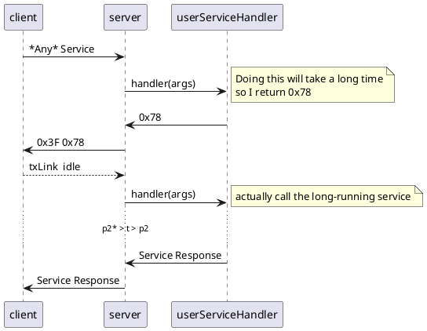
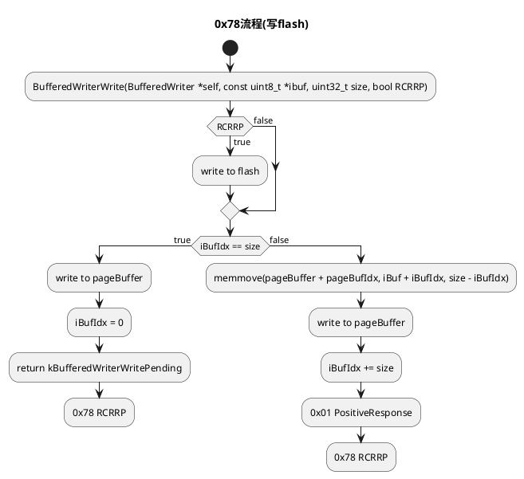

# iso14229

<p align="center">
<a href="https://github.com/driftregion/iso14229/actions"></a>
<a href="./LICENSE"></a>
</p>

iso14229是个针对嵌入式系统的UDS(ISO14229-1:2013)服务器和客户端会话层实现。为了让你能够更快上手、本库已包含[`isotp-c`](https://github.com/lishen2/isotp-c)以及linux内核ISO15765-2 (ISO-TP)传输层实现。

API状态: **未稳定** 

## 快速上手: 服务器

```c
#include "iso14229.h"

static uint8_t fn(UDSServer_t *srv, UDSServerEvent_t ev, const void *arg) {
    return kServiceNotSupported;
}

int main() {
    UDSServer_t server;
    UDSServerConfig_t cfg = {
        .fn = &fn,
    };
    UDSServerInit(&server, &cfg);
    for (;;) {
        UDSServerPoll(&server);
    }
}
```

## 快速上手: 客户端

```c
// 参考 examples/client.c
```

特点:
- 静态内存分配
- 独立于处理器架构
    - 测试了: arm, x86-64, ppc
    - 可以用qemu测试更多
- 单元测试又多又容易扩展

##  支持服务(服务器和客户端)

| SID | 英文名 | 支持 |
| - | - | - |
| 0x10 | diagnostic session control | ✅ |
| 0x11 | ECU reset | ✅ |
| 0x14 | clear diagnostic information | ❌ |
| 0x19 | read DTC information | ❌ |
| 0x22 | read data by identifier | ✅ |
| 0x23 | read memory by address | ❌ |
| 0x24 | read scaling data by identifier | ❌ |
| 0x27 | security access | ✅ |
| 0x28 | communication control | ✅ |
| 0x2A | read periodic data by identifier | ❌ |
| 0x2C | dynamically define data identifier | ❌ |
| 0x2E | write data by identifier | ✅ |
| 0x2F | input control by identifier | ❌ |
| 0x31 | routine control | ✅ |
| 0x34 | request download | ✅ |
| 0x35 | request upload | ❌ |
| 0x36 | transfer data | ✅ |
| 0x37 | request transfer exit | ✅ |
| 0x38 | request file transfer | ❌ |
| 0x3D | write memory by address | ❌ |
| 0x3E | tester present | ✅ |
| 0x83 | access timing parameter | ❌ |
| 0x84 | secured data transmission | ❌ |
| 0x85 | control DTC setting | ✅ |
| 0x86 | response on event | ❌ |

# 文档 

## 服务器事件

参考[iso14229.h](./iso14229.h) `enum UDSServerEvent`

### `UDS_SRV_EVT_DiagSessCtrl` (0x10) 会话控制

#### 参数

```c
typedef struct {
    const enum UDSDiagnosticSessionType type; /**< 请求会话类型 */
    uint16_t p2_ms;                           /**< 可选返回值: p2时间设置 */
    uint32_t p2_star_ms;                      /**< 可选返回值: p2*时间设置 */
} UDSDiagSessCtrlArgs_t;
```

#### 支持返回值

| 值 | 枚举 | 意义 | 
| - | - | - | 
| `0x00` | `kPositiveResponse` | 允许进入请求中的会话类型 |
| `0x12` | `kSubFunctionNotSupported` | 本器不支持请求中的会话类型 |
| `0x22` | `kConditionsNotCorrect` | 本器当前无法进入请求的会话类型 |

### `UDS_SRV_EVT_ECUReset` (0x11)  ECU复位

#### 参数

```c
typedef struct {
    const enum UDSECUResetType type; /**< 请求的复位类型 */
    uint8_t powerDownTime; /**< 可选返回值: 通知客户端离关机的时间(0-254秒) 255表示无法判断具体关机时间*/
} UDSECUResetArgs_t;
```

#### 支持返回值

| 值 | 枚举 | 意义 | 
| - | - | - | 
| `0x00` | `kPositiveResponse` | 允许复位  |
| `0x12` | `kSubFunctionNotSupported` | 本器不支持请求的复位类型 |
| `0x22` | `kConditionsNotCorrect` | 本器目前无法复位 |
| `0x33` | `kSecurityAccessDenied` | 当前安全级别不允许复位 |

### `UDS_SRV_EVT_ReadDataByIdent` (0x22) 读取数据

#### 参数

```c
typedef struct {
    const uint16_t dataId; /*! 数据标识符 */
    /*! 函数：拷贝数据到服务器发送缓冲器. 成功会返回`kPositiveResponse`。若数据大小超过了服务器发送缓冲器的大小、会返回`kResponseTooLong`。*/
    const uint8_t (*copy)(UDSServer_t *srv, const void *src,
                    uint16_t count); 
} UDSRDBIArgs_t;
```

#### 支持返回值

| 值 | 枚举 | 意义 | 
| - | - | - | 
| `0x00` | `kPositiveResponse` | 允许读取 (注意调用`copy(...)`) |
| `0x14` | `kResponseTooLong` | 响应大小超过发送缓冲器大小 |
| `0x31` | `kRequestOutOfRange` | 请求的标识符不支持 |
| `0x33` | `kSecurityAccessDenied` | 当前安全级别不允许读取请求的数据标识符 |

### `UDS_SRV_EVT_SecAccessRequestSeed`, `UDS_SRV_EVT_SecAccessValidateKey` (0x27) 安全访问

#### 参数

```c
typedef struct {
    const uint8_t level;             /*! 请求安全级别 */
    const uint8_t *const dataRecord; /*! 请求数据 */
    const uint16_t len;              /*! 请求数据大小 */
    /*! 函数：拷贝数据到服务器发送缓冲器. 成功会返回`kPositiveResponse`。若数据大小超过了服务器发送缓冲器的大小、会返回`kResponseTooLong`。*/
    uint8_t (*copySeed)(UDSServer_t *srv, const void *src,
                        uint16_t len);
} UDSSecAccessRequestSeedArgs_t;

typedef struct {
    const uint8_t level;      /*! 请求安全访问级别 */
    const uint8_t *const key; /*! 客户端发过来的密钥 */
    const uint16_t len;       /*! 密钥大小 */
} UDSSecAccessValidateKeyArgs_t;
```
#### 支持返回值

| 值 | 枚举 | 意义 | 
| - | - | - | 
| `0x00` | `kPositiveResponse` | 肯定响应 |
| `0x12` | `kSubFunctionNotSupported` | 该安全级别未支持 |
| `0x22` | `kConditionsNotCorrect` | 当前无法处理该请求 |
| `0x31` | `kRequestOutOfRange` | `dataRecord`的数据无效 |
| `0x35` | `kInvalidKey` | 密钥对不上 |
| `0x36` | `kExceededNumberOfAttempts` | 密码错误太多 |
| `0x37` | `kRequiredTimeDelayNotExpired` | 不晓得 |

### `UDS_SRV_EVT_CommCtrl` (0x28) 通讯控制

#### 参数

```c
typedef struct {
    enum UDSCommunicationControlType ctrlType; 
    enum UDSCommunicationType commType;
} UDSCommCtrlArgs_t;
```
#### 支持返回值

| 值 | 枚举 | 意义 | 
| - | - | - | 
| `0x00` | `kPositiveResponse` | 肯定响应 |
| `0x12` | `kSubFunctionNotSupported` | 请求中的通讯控制类型未支持 |
| `0x22` | `kConditionsNotCorrect` | 当前无法开启/关闭请求中的通讯控制类型|
| `0x31` | `kRequestOutOfRange` | 请求中的通讯控制类型或者通讯类型有错 |

### `UDS_SRV_EVT_WriteDataByIdent` (0x2E) 写入数据

#### 参数

```c
typedef struct {
    const uint16_t dataId;     /*! 数据标识符 */
    const uint8_t *const data; /*! 数据 */
    const uint16_t len;        /*! 数据大小 */
} UDSWDBIArgs_t;
```

#### 支持返回值

| 值 | 枚举 | 意义 | 
| - | - | - | 
| `0x00` | `kPositiveResponse` | 写入成功 |
| `0x22` | `kConditionsNotCorrect` | 当前无法写入 |
| `0x31` | `kRequestOutOfRange` | 数据标识符不支持或者数据内容有错 |
| `0x33` | `kSecurityAccessDenied` | 当前安全级别不允许写入请求中的数据标识符 |
| `0x72` | `kGeneralProgrammingFailure` | 写入内存失败 |

### `UDS_SRV_EVT_RoutineCtrl` (0x31) 例程控制

#### 参数

```c
typedef struct {
    const uint8_t ctrlType;      /*! 例程控制类型 */
    const uint16_t id;           /*! 例程标识符 */
    const uint8_t *optionRecord; /*! 客户端可选数据 */
    const uint16_t len;          /*! 数据大小 */
    /*! 函数：拷贝数据到服务器发送缓冲器. 成功会返回`kPositiveResponse`。若数据大小超过了服务器发送缓冲器的大小、会返回`kResponseTooLong`。*/
    uint8_t (*copyStatusRecord)(UDSServer_t *srv, const void *src,
                                uint16_t len); 
} UDSRoutineCtrlArgs_t;
```

#### 支持返回值

| 值 | 枚举 | 意义 | 
| - | - | - | 
| `0x00` | `kPositiveResponse` | 肯定响应 |
| `0x22` | `kConditionsNotCorrect` | 当前无法操作 |
| `0x24` | `kRequestSequenceError` | 要求停止但未开始。要求开始但已开始(可选)。没有结果因为例程从来没有开始。|
| `0x31` | `kRequestOutOfRange` | 请求中的例程标识符未支持或者`optionRecord`无效 |
| `0x33` | `kSecurityAccessDenied` | 当前安全访问级别不允许请求的操作 |
| `0x72` | `kGeneralProgrammingFailure` | 内部内存操作失败(如：擦除flash) |


### `UDS_SRV_EVT_RequestDownload` (0x34) 请求下载

#### 参数

```c
typedef struct {
    const void *addr;                   /*! 请求下载地址 */
    const size_t size;                  /*! 请求下载大小 */
    const uint8_t dataFormatIdentifier; /*! 可选：数据格式标识符 */
    uint16_t maxNumberOfBlockLength; /*! 返回值: 通知客户端能接受的`TransferData`长度是多长 */
} UDSRequestDownloadArgs_t;
```

#### 支持返回值

| 值 | 枚举 | 意义 | 
| - | - | - | 
| `0x00` | `kPositiveResponse` | 肯定响应 |
| `0x22` | `kConditionsNotCorrect` | 当前无法操作 |
| `0x31` | `kRequestOutOfRange` | `dataFormatIdentifier`,`addr`或者`size`无效。 |
| `0x33` | `kSecurityAccessDenied` | 当前安全访问级别不允许请求的操作 |
| `0x34` | `kAuthenticationRequired` | 客户端权利不足 |
| `0x70` | `kUploadDownloadNotAccepted` | 因故障无法下载 |

### `UDS_SRV_EVT_TransferData` (0x36) 传输数据

#### 参数

```c
typedef struct {
    const uint8_t *const data; /*! 数据 */
    const uint16_t len;        /*! 数据大小 */
    /*! 函数：拷贝数据到服务器发送缓冲器. 成功会返回`kPositiveResponse`。若数据大小超过了服务器发送缓冲器的大小、会返回`kResponseTooLong`。*/
    uint8_t (*copyResponse)(
        UDSServer_t *srv, const void *src,
        uint16_t len);
} UDSTransferDataArgs_t;
```

#### 支持返回值

| 值 | 枚举 | 意义 | 
| - | - | - | 
| `0x00` | `kPositiveResponse` | 肯定响应 |
| `0x31` | `kRequestOutOfRange` | `data`内容无效或者大小不对 |
| `0x72` | `kGeneralProgrammingFailure` | 写入内存失败 |
| `0x92` | `kVoltageTooHigh` | 无法写flash：电压过高 |
| `0x93` | `kVoltageTooLow` | 无法写flash：电压过低 |

### `UDS_SRV_EVT_RequestTransferExit` (0x37) 请求传输结束

#### 参数

```c
typedef struct {
    const uint8_t *const data; /*! 数据 */
    const uint16_t len;        /*! 数据大小 */
    /*! 函数：拷贝数据到服务器发送缓冲器. 成功会返回`kPositiveResponse`。若数据大小超过了服务器发送缓冲器的大小、会返回`kResponseTooLong`。*/
    uint8_t (*copyResponse)(UDSServer_t *srv, const void *src,
                            uint16_t len);
} UDSRequestTransferExitArgs_t;
```

#### 支持返回值

| 值 | 枚举 | 意义 | 
| - | - | - | 
| `0x00` | `kPositiveResponse` | 肯定响应 |
| `0x31` | `kRequestOutOfRange` | `data`内容无效或者大小不对 |
| `0x72` | `kGeneralProgrammingFailure` | 完成数据传输失败 |

## 例子

[examples/README.md](examples/README.md)

## 测试

[test_uds.c](test_uds.c)

### 运行测试 

```sh
make test
```

## qemu

```sh
CC=powerpc-linux-gnu-gcc make test_bin
qemu-ppc -L /usr/powerpc-linux-gnu test_bin
```
## wine

```sh
CC=x86_64-w64-mingw32-gcc make test_bin
wine test_bin.exe
```


# 贡献

欢迎提交贡献


# 感谢 

- [`isotp`](https://github.com/lishen2/isotp-c) which this project embeds

# 许可

MIT

# 变更记录

## 0.0.0
- 初次发布

## 0.1.0
- 加客户端
- 加服务器SID 0x27安全访问
- API更改

## 0.2.0
- 删除所有`__attribute__((packed))`
- 为了简化测试、重构服务器下载功能单元
- 重构测试 
    - 按服务排列 
    - 给宏定义写文档 
- 删掉了中间件 
- 简化了服务器例程控制API 
- 删掉了重复函数`udsServerEnableService` 
- 更新例子 

## 0.3.0
- 加`udsClientRunSequenceBlocking(...)` 
- 加了服务器和客户端例子 
- 简化测试流程、删掉了过分模糊宏定义和switch结构 
- 服务器和客户端结构体简化：尽量用一层深度 
- 简化使用、放isotp-c初始化参数到服务器/客户端配置里面 
- 删除重复服务器缓冲器 

# 0.4.0
- 重构RDBIHandler：用安全memmove
- 尽可能不用enum在结构体里面
- 传输层可插件。现在支持linux内核ISO-TP驱动。`isotp-c`同时也支持。看看例子 [examples](./examples/README.md)

## 0.5.0
- 可用性: 重构成单个.c/.h模块
- 可用性: 默认传输层配置现在自带
- API整理: 用`UDS`前缀在所有导出函数上
- API整理: 服务器事件用单个回调函数
---


# 开发者文档 


## 客户端请求状态机








## 服务器 0x78 requestCorrectlyReceived-ResponsePending





